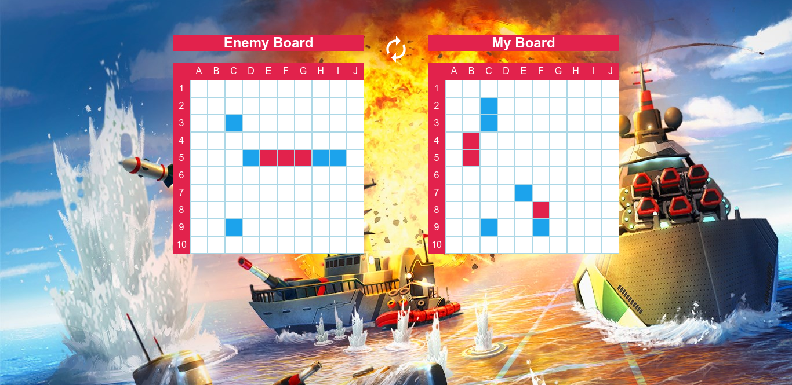

# Battleship game



This is the famous Battleship game, built in JavaScript.
You can check out the [live demo](https://jeton-th.github.io/battleship/).

## Game description
The game is played by two players, one of them being the computer. Both players have a board with 10 rows and 10 columns. 5 ships with different length are randomly placed in each board. The game is played by hitting the opposite ships in order to sink them.

Ships & their size :
* Carrier   ~   5
* Battleship ~    4
* Patrol boat ~   2
* Submarine	   ~ 3
* Destroyer	   ~ 3

### Game rules
* Each player clicks a field in the board in order to attack and oposite ship.
* If the attack is a miss the turn is changed to the other player.
* If the attack is a hit, the same player can attack consecutively.
* If all the fields of the ship are hit the ship is sunk.
* The winner is the player who sinks all of the opponent ships first.

## Getting Started

Follow these instructions to get a copy of the project up and running on your
local machine for development and testing purposes.

### Prerequisites  

This project runs with Node.js and NPM. If you don't have those installed, follow this
[guide](https://docs.npmjs.com/downloading-and-installing-node-js-and-npm).  
Then if you haven't already, clone the [repository](https://github.com/jeton-th/battleship).

### Installing  

Install all project dependencies:
```
npm install
```

### Serve Project

Start the application with the following command:
```
npm start
```
The page will automatically open in the browser.

## Contributors:
* [Jeton Thaçi](https://github.com/jeton-th)
* [Zeha Irawan](https://github.com/JangkarBumi)